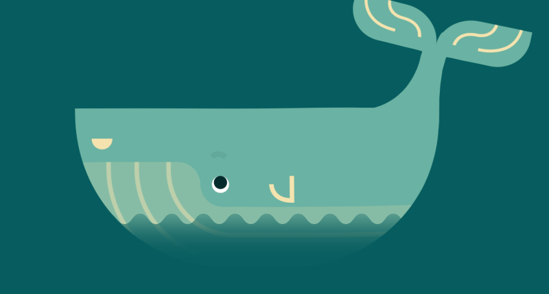

# Hi 👋, I'm Cesar

  

## 🛠️ FullStack Developer | Architecture Enthusiast

Passionate about building scalable, structured, and maintainable server-side applications. My core focus is on **Clean Architecture** and **Domain-Driven Design (DDD)**.

- ☕ **Core Stack:** Java (Spring Boot), Python (FastApi), Typescript (NestJS).
- 🏗️ **Architectures:** Clean Architecture, Microservices, and Modular Monoliths.
- 🐳 **Infrastructure:** Experience with Docker, PostgreSQL, and building CI/CD pipelines.
- 🎓 **Currently:** Computer Engineering student at **UCAB**.

---

## 🚀 Technologies & Tools

### Backend & Infrastructure

### Languages & Scripting

### Frontend

### Others

---

## ⚡ Where to find me

